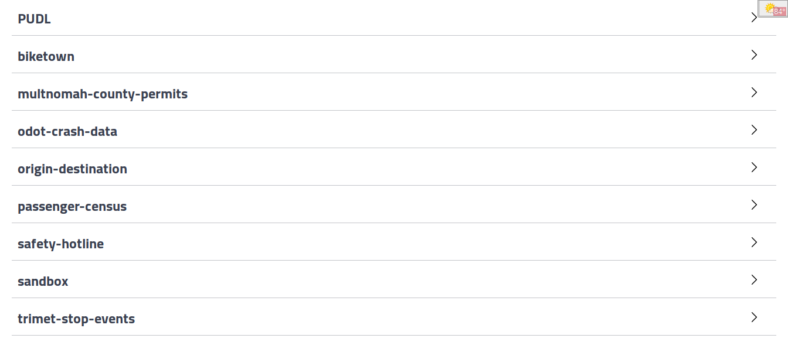
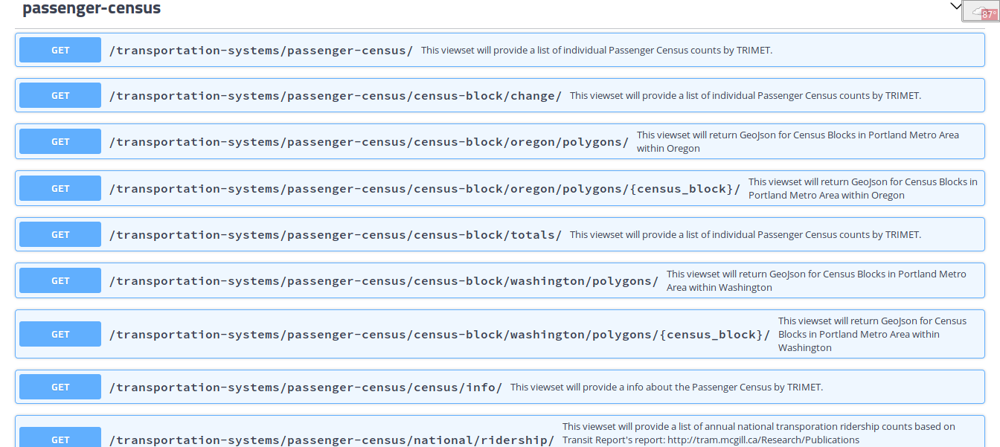
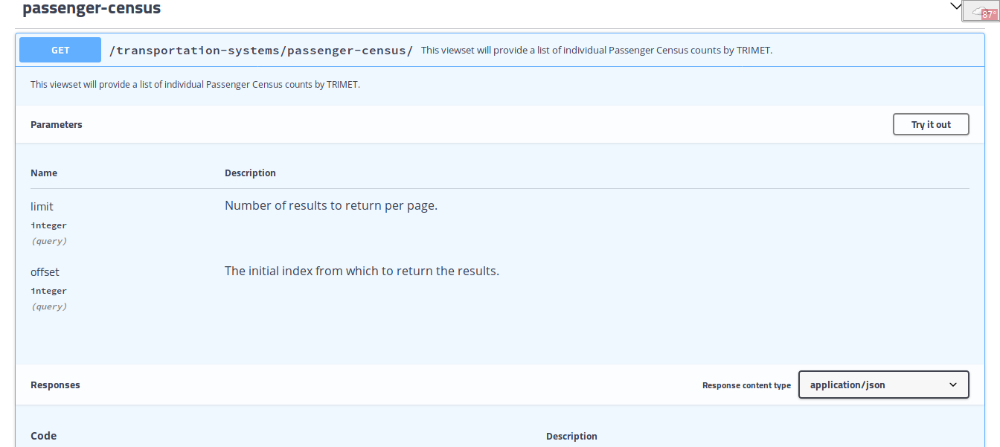
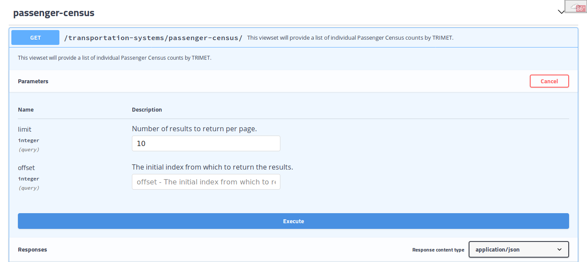

```{r setup, include=FALSE}
knitr::opts_chunk$set(echo = FALSE)
```

# Dataset Overview

## passenger-census
* Ridership data
* Covers March 2001 through February 2018
* Lists totals of ons and offs for each stop by service key
    - Totals over six months
    - W = weekday
    - S = Saturday
    - U = Sunday

## trimet-stop-events
* Raw data - samples of all vehicle data every five seconds!
* Large - about 10 gigabytes per month!
* TriMet gave us five months of data:
    - September 2017
    - October 2017
    - November 2017
    - April 2018
    - May 2018
* Only a subset hosted in the API

## origin-destination
* Census Bureau data on commuting
* Covers 2002 through 2015
* Covers entire Portland - Vancouver metro area
* Very detailed - only a subset is hosted in the API

## Other datasets in the Transportation Systems API
* PUDL: locations of traffic sensors for the Portland Urban Data Lake (PUDL)
* biketown: public data dump from Biketown
* multnomah-county-permits: permit data from Multnomah county outside city limits
* odot-crash-data: crashes in Portland from 2004 - 2014
* safety-hotline: calls / texts / emails to the safety hotline

# Browsing the API

## "Swagger UI"
* Browse to <http://service.civicpdx.org/transportation-systems/>
* Scroll down

## Swagger UI home page


## Click on `passenger-census` to expand


## Click on the first `GET` to expand


## Click on `Try it out` and enter `1` for `limit`


## Click on `Execute` and scroll down to `response body`


## Click on `Download` and save as `response.txt`


# Passenger Census Data

## GIS
      {
        "id": 499600,
        "type": "Feature",
        "geometry": {
          "type": "Point",
          "coordinates": [
            -122.53780401445013,
            45.509916142766684
          ]
        },

## Properties
        "properties": {
          "summary_begin_date": "2002-03-03",
          "route_number": 71,
          "direction": 1,
          "service_key": "U",
          "stop_seq": 6675,
          "location_id": 9496,
          "public_location_description": "SE 122nd & Mill",
          "ons": 2,
          "offs": 4,
          "x_coord": 7679750.6398098,
          "y_coord": 678590.38676998,
          "census_block": "410510082023001"
        }


# TriMet Stop Events Data

## TBD

# Origin-Destination Data

## Source
* Census Bureau Longitudinal Employer-Household Dynamics (LEHD)
    - https://lehd.ces.census.gov
* LEHD Origin-Destination Employment Statistics (LODES)
    - https://lehd.ces.census.gov/data/#lodes
* LODES 7.3 Technical Documentation
    - https://lehd.ces.census.gov/data/lodes/LODES7/LODESTechDoc7.3.pdf

## More TBD