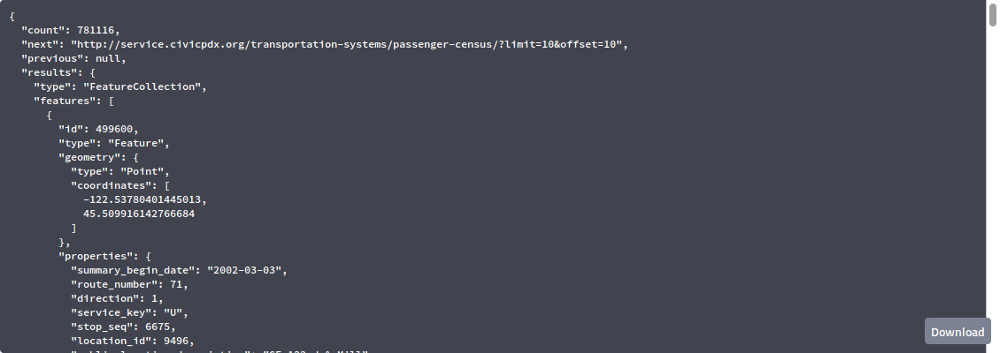

```{r setup, include=FALSE}
knitr::opts_chunk$set(echo = FALSE)
```

# TriMet datasets

## passenger-census
* Ridership data
* Covers March 2001 through February 2018
* Lists totals of ons and offs for each stop by service key
    - Totals over six months
    - W = weekday
    - S = Saturday
    - U = Sunday

## trimet-stop-events
* Raw data - samples of all vehicle data every five seconds!
* Large - about 10 gigabytes per month!
* TriMet gave us five months of data:
    - September 2017
    - October 2017
    - November 2017
    - April 2018
    - May 2018

## Other datasets in the Transportation Systems API
* PUDL: locations of traffic sensors for the Portland Urban Data Lake (PUDL)
* biketown: public data dump from Biketown
* multnomah-county-permits: permit data from Multnomah county outside city limits
* odot-crash-data: crashes in Portland from 2004 - 2014
* safety-hotline: calls / texts / emails to the safety hotline
* origin-destination: Census Bureau LODES data for Portland - Vancouver metro area

# Browsing the API

## "Swagger UI"
* Browse to <http://service.civicpdx.org/transportation-systems/>
* Scroll down

## Swagger UI home page


## Expand `passenger-census`


## Expand the first `GET`


## Try it out (enter `10` for `limit`)


## Execute and scroll down


# Passenger Census Data

# TriMet Stop Events Data

## TBD

# Origin-Destination Data

## TBD